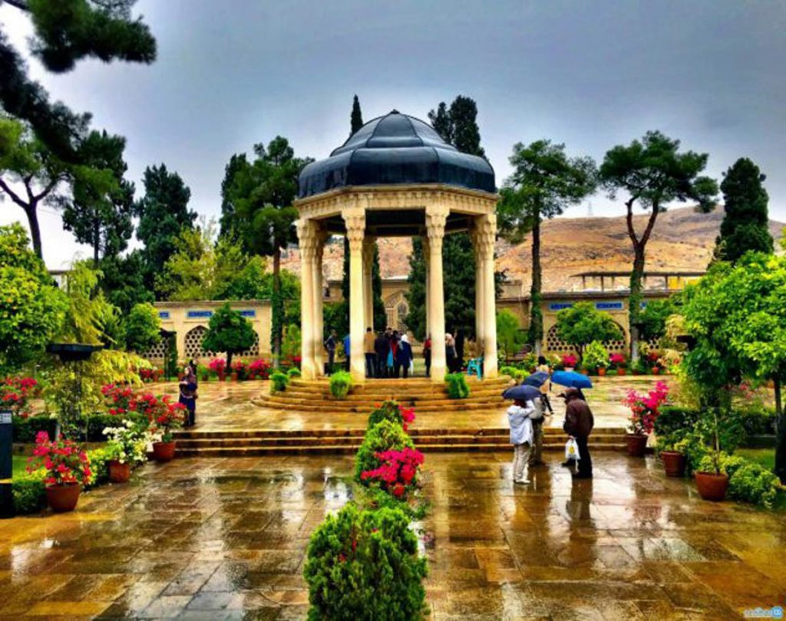

# Shiraz Travel Guide

## Introduction
Shiraz that known as **City of poetry and Gardens** is one of the most beautiful cities of Iran.You will enjoy visiting historical places, natural landscapes and old markets,in addition,You can also try our wonderful foods.This guide will help you to explore the best places,foods,costs and travel tips for your trip to Shiraz.

### History of Shiraz
Shiraz, one of Iran's oldest cities, has a rich cultural and historical legacy. It is famously the birthplace of two of Iran's greatest poets, **Hafez** and **Saadi**. Throughout history, it has been known for its contributions to Persian culture and literature.

### Top Attractions
- **Eram Garden**: a persian garden with beautiful landscape and architecture.
- **Tomb of Hafez**: the resting place of Famouse persian poet *Hafez*.
- **Persepolis**: the ruins of the ancient Persian empire, a UNESCO World Heritage Site.

### Foods and Dishes
1. **Kalampolo**:A traditional dish with rice, cabbage, and meatballs.
2. **Shirazi salad**:A refreshing salad with tomatoes, cucumbers, and onions. 
3. **Faloode shirazi**:A unique Persian dessert made with frozen vermicelli and rosewater syrup.

### Old Markets
+ **Vakil Bazar**:A traditional market where you can buy handicrafts, carpets, and souvenirs.
+ **Golestan Bazar**:A large market for local products and arts.
 
### Costs
Here are the approximated prices :
>> Hotel (per night): €30-€100
Food(per day per person): €10-€25
Transportation: €5-€20
Entrance fees: €5-€10

### Tipps and Informations
+ Best visiting Time: March-May OR September-November
+ Currency: Iranian Rial(IRR)
+ Public Transportation: Taxi.Bus-Apps like [Snapp](https://snapp.ir/download/)

#### Useful Links
+ Iran Tourism Website: <https://www.mysafar.com/mag/iran-tourism/sightseeing-places-in-iran/#:~:text=25%20%D8%AA%D8%A7%20%D8%A7%D8%B2%20%D8%A8%D9%87%D8%AA%D8%B1%DB%8C%D9%86%20%D8%AC%D8%A7%D9%87%D8%A7%DB%8C%20%D8%AF%DB%8C%D8%AF%D9%86%DB%8C%20%D8%A7%DB%8C%D8%B1%D8%A7%D9%86%20%DA%A9%D9%87,%D9%81%D8%B1%D8%AF%D9%88%D8%B3%DB%8C%3A%20%D8%B4%D8%A7%D8%B9%D8%B1%20%D8%AD%D9%85%D8%A7%D8%B3%D9%87%20%D8%B3%D8%B1%D8%A7%DB%8C%20%D8%A7%DB%8C%D8%B1%D8%A7%D9%86%DB%8C%20...%20Weitere%20Elemente>
+ Hotel Booking: <https://booking.com>

   
