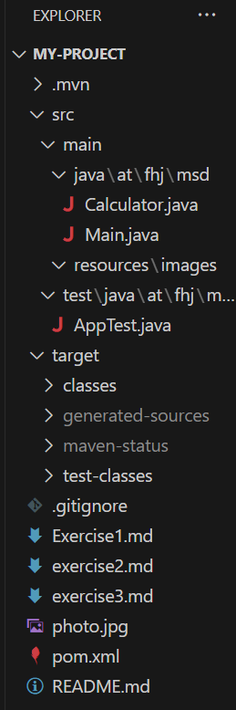
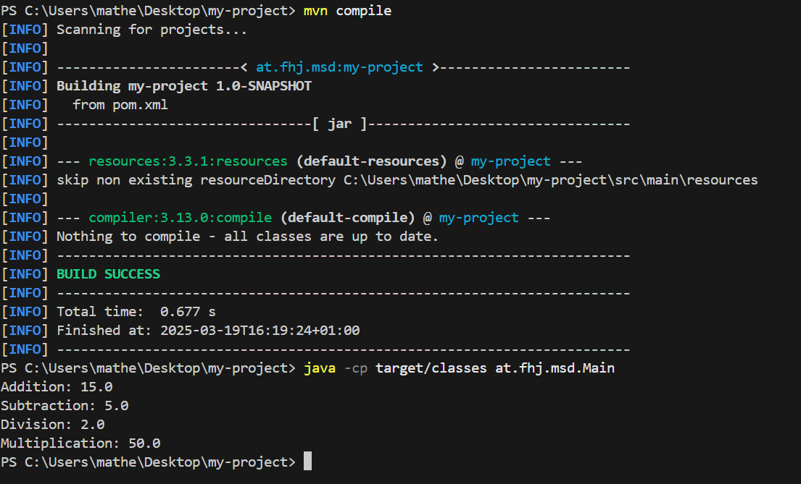
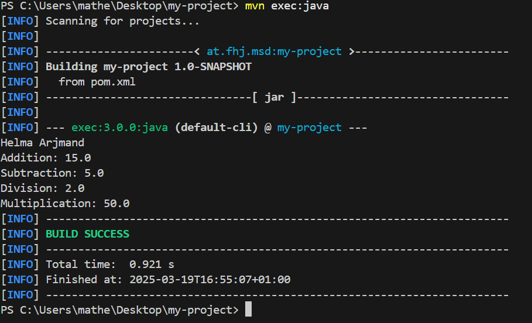

# Summary of All Steps in Creating exercise3.md
1. Initialize Git Repository
Run git init to initialize a new Git repository.
Connect the local repository to GitHub 
git remote add origin https://github.com/ArjmandHelma/msd24_Arjmand_Helma

2. Create a New Maven Project
Open IntelliJ IDEA → File → New → Project.
Select Maven and choose the Quickstart Archetype.
GroupId: at.fhj.msd
ArtifactId: calculator

3. Verify Project Structure
.git/ (Git repository)
.idea/ (IntelliJ settings)
src/ (Source code)
pom.xml (Maven configuration file)

4. Modify .gitignore
update .gitignore to exclude unnecessary files:

5. Commit and Push Project to GitHub
Add all files to Git
git add .
git commit -m "commit"
git push -u origin main

6. Create exercise3.md File
Documentation ot the steps taken in the project.
Save and commit the file

## Project structure
Here is the screenshot for project structure 

## Successful Execution
Here is the screenshot for Successful Execution

## Programm output
Here is the screenshot for Programm output

